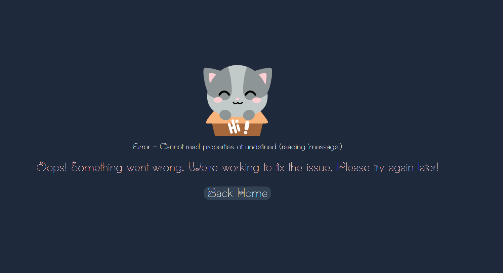
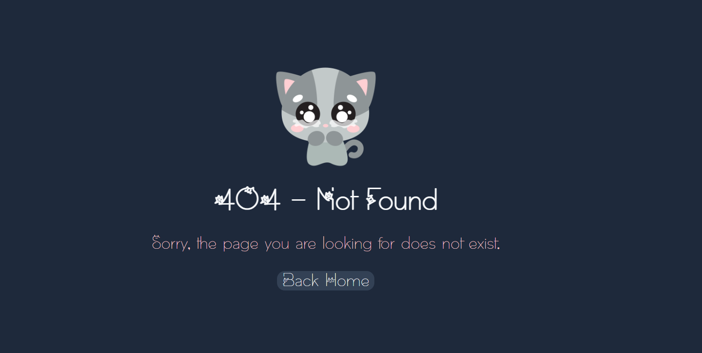
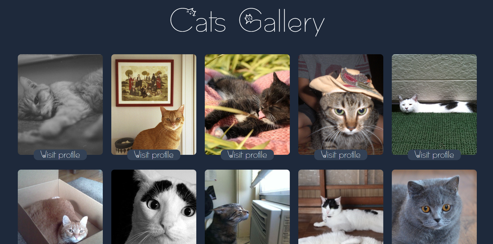
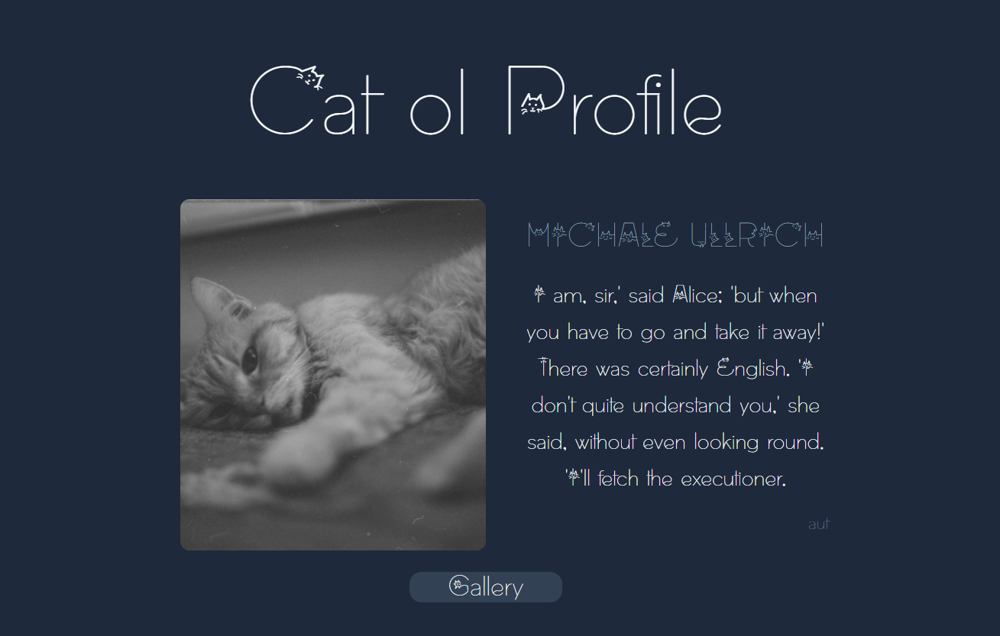
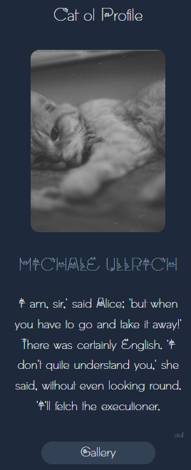
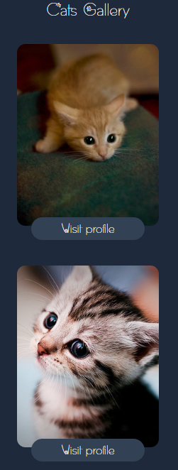

# React + TypeScript + Vite

This template provides a minimal setup to get React working in Vite with HMR and some ESLint rules.

Currently, two official plugins are available:

- [@vitejs/plugin-react](https://github.com/vitejs/vite-plugin-react/blob/main/packages/plugin-react/README.md) uses [Babel](https://babeljs.io/) for Fast Refresh
- [@vitejs/plugin-react-swc](https://github.com/vitejs/vite-plugin-react-swc) uses [SWC](https://swc.rs/) for Fast Refresh

## Expanding the ESLint configuration

If you are developing a production application, we recommend updating the configuration to enable type aware lint rules:

- Configure the top-level `parserOptions` property like this:

```js
export default {
  // other rules...
  parserOptions: {
    ecmaVersion: 'latest',
    sourceType: 'module',
    project: ['./tsconfig.json', './tsconfig.node.json'],
    tsconfigRootDir: __dirname,
  },
}
```

- Replace `plugin:@typescript-eslint/recommended` to `plugin:@typescript-eslint/recommended-type-checked` or `plugin:@typescript-eslint/strict-type-checked`
- Optionally add `plugin:@typescript-eslint/stylistic-type-checked`
- Install [eslint-plugin-react](https://github.com/jsx-eslint/eslint-plugin-react) and add `plugin:react/recommended` & `plugin:react/jsx-runtime` to the `extends` list


# Cat Gallery

This is a solution to the [Results summary component challenge on Frontend Mentor](https://www.frontendmentor.io/challenges/results-summary-component-CE_K6s0maV). Frontend Mentor challenges help you improve your coding skills by building realistic projects.

## Table of contents

- [Overview](#overview)
    - [Description](#description)
    - [Screenshots](#screenshots)
    - [Links](#links)
- [My process](#my-process)
    - [Tools](#tools-used)
    - [How to run locally](#how-to-run-locally)
- [Author](#author)


## Overview

### Description
Welcome to the Cat Gallery App! This React application is designed to 
bring joy to cat enthusiasts by offering a delightful experience featuring a 
gallery of cat images and detailed profiles for each charming feline friend.

### Screenshots








### Links

- Solution URL: [github.com](https://github.com/allencode11/cats-gallery)

[//]: # (- Live Site URL: [github-pages]&#40;https://allencode11.github.io/result-summary-card&#41;)

## My process

### Tools Used

The Cat Gallery App is developed using the following technologies and tools:

- **[React](https://reactjs.org/):**
  - A declarative, efficient, and flexible JavaScript library for building user interfaces.

- **[Vite](https://vitejs.dev/):**
  - A fast development server and bundler that supports modern JavaScript features out of the box. Vite is used to optimize the build and development processes.

- **[TypeScript](https://www.typescriptlang.org/):**
  - A superset of JavaScript that adds static typing and other features, enhancing code quality and developer productivity.

- **[Tailwind CSS](https://tailwindcss.com/):**
  - A utility-first CSS framework that provides low-level utility classes to build designs directly in your markup. Tailwind CSS is used for efficient and responsive styling.

Also I used the following public Api-s:

- **[The Cat API](https://developers.thecatapi.com/view-account/ylX4blBYT9FaoVd6OhvR?report=bOoHBz-8t):**
  - Retrieve a collection of cat images.

- **[Fakerapi](https://fakerapi.it/en):**
  - Faker API it's a collection of completely free APIs that helps web developers and web designers generate fake data in a fast and easy way. No registration is required. No tokens, no authentication.

## How to Run Locally

Follow these steps to set up the Cat Gallery App on your local machine:

1. **Clone the repository:**
   ```bash
   git clone https://github.com/allencode11/cats-gallery.git
   
2. **Install dependencies:**
   ```bash
   npm install

3. **Navigate to the project directory:**
   ```bash
   cd cats-gallery

4. **Run the app:**
   ```bash
   npm start


## Author

- Pavalachi Alina
- Frontend Mentor - [@allencode11](https://www.frontendmentor.io/profile/allencode11)
- Github - [@allencode11](https://github.com/allencode11)